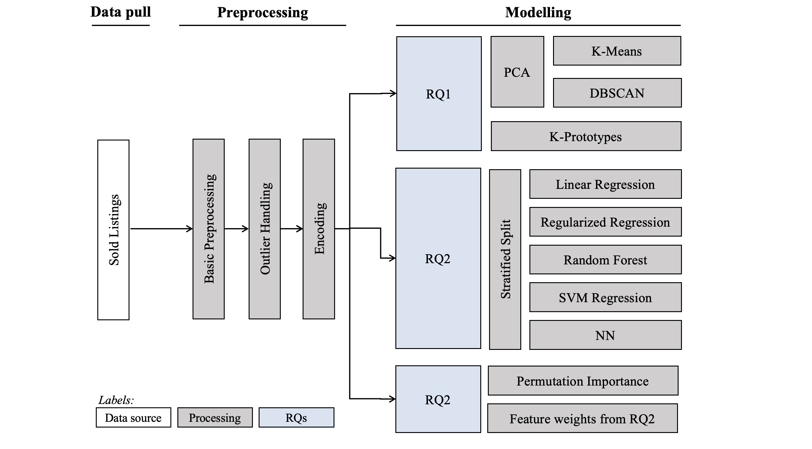

# Data Mining for Price Prediction at Trendsales a.k.a. pricing_wizards
## Leveraging Machine Learning Techniques for the Nordics' largest Fashion Marketplace

This is a repository for all programming related assets used in the exam project, Pricing Wizards, for the course Data Mining at ITU.

### Usage

To run code, please place the dataset from the uploaded .zip folder in your local data folder. The background is that due to data being proprietary, we may not upload it to this public GitHub repo.

### Motivation

Given the recommendation of a plain colab link, the format of this deliverable may come as a surprise. As outlined in the Introduction of the accompanying report, the dataset was selected to apply the Data Mining techniques learned in the course in a real-life setting. In this same vein, we collaborated in GitHub and followed other coding best practices, as visible in this folder, like
* Pickling models and storing them in a dedicated folder to enable reproducability
* Isolating function components into dedicated, importable scripts
* Establishing data processing pipelines in a dedicated class
* Operating with a requirements.txt based virtual environment

### Project Methodology

### Folder Structure

- `/data`: Directory to store datasets
- `/models`: Directory for python model script
    - `/pickled_models`: Storage for pickled versions of trained models
- `/notebooks`: Used for training of models and data exploration
- `/scripts`: Used to store python scripts
- `/utils`: Helper functions

### Mapping Methodology to Repo

| Methodology          | Location in repo               |
|----------------------|--------------------------------|
| Data pull            | data_pull.sql                  |
| Basic preprocessing  | notebooks/preprocessing.ipynb  |
| Outlier handling     | utils/Dataloader.py            |
| Encoding             | utils/DataTransformation.py    |
| RQ1: Clustering      | notebooks/clustering.ipynb     |
| RQ2: Price prediction| notebooks, models, utils       |
| RQ3: Feature importance | ADD HERE                    |
